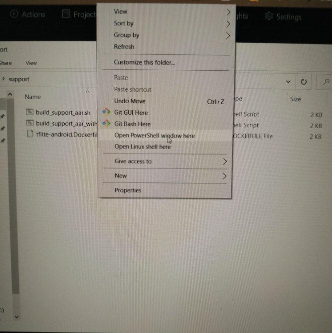

# Build TensorFlow Lite Support Library With Docker

This is an extended guide that illustrates how to build Tensorflow Lite Support library with [Docker](https://www.docker.com/) inside Windows. This procedure is useful to developers that want to make changes to the library but they haven't installed [Bazel](https://bazel.build/) to their system. After build procedure the developer can obtain an .aar file that can be used inside an Android Studio project.

## First install Docker
If you have already Docker in your system then you can skip this part. If not go to the official page, download [Docker for Windows](https://www.docker.com/products/docker-desktop) and install Docker in your system. Run Docker desktop and if it prompts to upgrade WSL 2 then do this procedure also. After a restart of your PC run again to start Docker. You will see at your desktop the main window:

## Then collect neccessary files and start a container
Create a new folder and insert the 3 important files (that you can find here at the main branch) inside (build_support_aar_with_docker.sh, build_support_aar.sh and tflite-android.Dockerfile):

Click Shift + Right click of mouse and open a PowerShell window inside the folder that contains the 3 files:

Then copy, paste command `docker build . -t tf-support-builder -f tflite-android.Dockerfile` inside the Powershell window that has been opened:

Hit Enter and Docker starts downloading TensorFlow latest code, Android SDK and NDK:

Copy, paste and run command `docker run -it -v pwd:/host_dir tf-support-builder bash` to start the container. After some seconds you will see:

## Import the script files at specific locations inside Docker container

To do this procedure we have to open a second Power shell window at the same folder where the scripts are. This is because at the first container we are already in Linux environment inside the container and we cannot move the files from Windows:

We execute command `docker container ls --all` to find out the number of containers that exist and their names eg d40836790a39. After that we move the 2 script files and the folder that contains the TensorFlow Lite Support libray inside specific locations of the container:
- First execute `docker cp build_support_aar.sh d40836790a39:/tensorflow_src/tensorflow/lite/tools/` to insert it at `d40836790a39` container and inside `tensorflow_src/tensorflow/lite/tools` folder
- Second move tensorflow_lite_support folder inside the container by executing `docker cp tensorflow_lite_support d40836790a39:/tensorflow_src` 

