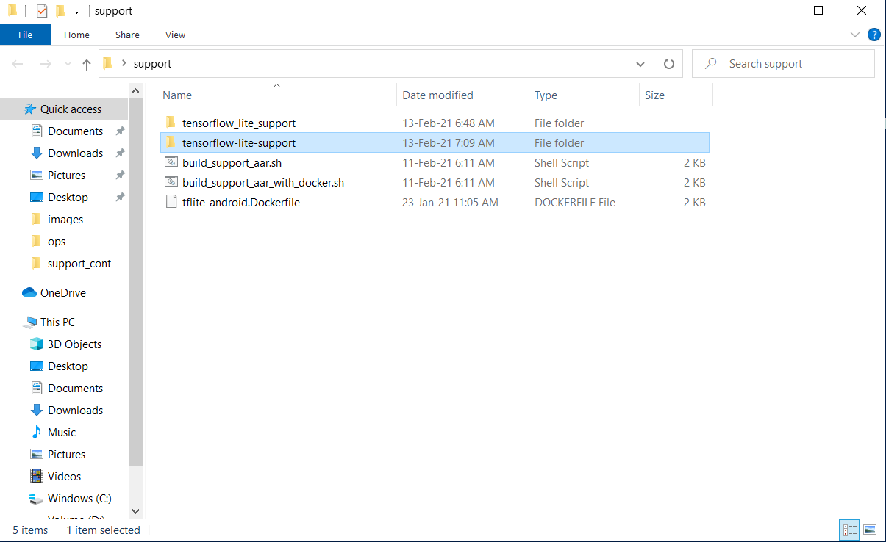

# Build TensorFlow Lite Support Library With Docker

This is an extended guide that illustrates how to build [Tensorflow Lite Support](https://github.com/tensorflow/tflite-support) library with [Docker](https://www.docker.com/) inside Windows. This procedure is useful to developers that want to make changes to the library but they haven't installed [Bazel](https://bazel.build/) to their system. After build procedure the developer can obtain an .aar file that can be used inside an Android Studio project.

## First install Docker
If you have already Docker in your system then you can skip this part. If not go to the official page, download [Docker for Windows](https://www.docker.com/products/docker-desktop) and install Docker in your system. Run Docker desktop and if it prompts to upgrade WSL 2 then do this procedure also. After a restart of your PC run again to start Docker. You will see at your desktop the main window:

## Collect neccessary files and start a container
Create a new folder and insert the 3 important files (build_support_aar_with_docker.sh, build_support_aar.sh and tflite-android.Dockerfile) that you can find here at the main branch:

Click Shift + Right click of mouse and open a PowerShell window inside the folder that contains the 3 files:

Then copy, paste command

`docker build . -t tf-support-builder -f tflite-android.Dockerfile`

inside the Powershell window that has been opened:

Hit Enter and Docker starts downloading TensorFlow latest code, Android SDK and NDK:

After the end of the above procedure copy, paste and run command 

`docker run -it -v pwd:/host_dir tf-support-builder bash`

to start the container. After some seconds you will see:

## Download the tensorflow_lite_support folder

Go to official Google's [repository](https://github.com/tensorflow/tflite-support) and download the code. We are specifically interested in the tensorflow_lite_support folder so unzip the file that you have downloaded from the repository and copy paste only the tensorflow_lite_support folder inside the folder that you have the 3 important files.

In case you want to do some changes to the script files or the folder files **do them before the below procedure**.

## Import the script files and tensorflow_lite_support folder at specific locations inside Docker container

To do this procedure we have to open a second Power shell window at the same folder where the scripts are. This is because at the first container we are already in Linux environment inside the container and we cannot move the files from Windows:

We execute command `docker container ls --all` to find out the number of containers that exist and their names eg d40836790a39. After that we move the 2 script files and the folder that contains the TensorFlow Lite Support files inside specific locations of the container:
- First execute

`docker cp build_support_aar.sh d40836790a39:/tensorflow_src/tensorflow/lite/tools/` 

to insert it at `d40836790a39` container and inside `tensorflow_src/tensorflow/lite/tools` folder
- Second move tensorflow_lite_support folder inside the container by executing 

`docker cp tensorflow_lite_support d40836790a39:/tensorflow_src` 

- Third execute

`docker cp build_support_aar_with_docker.sh d40836790a39:/` 

to move the second script file at the container

**CAUTION**: name of the container always change so do not use `d40836790a39` but find out yours and replace at the above 3 commands.

## Go back at the first Power Shell window and execute linux commands

First execute `ls` to view the files

Second make the script file executable by inserting and running `chmod +x build_support_aar_with_docker.sh`

Third set the location of the Python library by inserting and running: `sudo ln -sf /usr/bin/python3 /usr/bin/python`

Finally copy paste `./build_support_aar_with_docker.sh` and run it.

Now procedure runs, respond "Yes" to Google's License agreement and neccessary libraries are downloaded.

After 5-10 minutes build will be successful.

## Move generated folder from container back to Windows folder

At the second Powershell window where we can execute windows commands copy, paste and run

`docker cp d40836790a39:tensorflow_src/bazel-bin/tensorflow_lite_support tensorflow-lite-support`

With this command we move all the generates files from the container back to Windows file system. 

**CAUTION**: name of the container always change so do not use `d40836790a39` but find out yours and replace at the above command.

If we open the tensorflow-lite-support folder and then java folder we can see the generated files. We are specifically interested in libtensorflowlite_support.jar file:

**Rename** the specific file to classes.jar and follow the below procedure

## Download latest tensorflow_lite_support.aar file from Maven repository

Go to this [link](https://dl.bintray.com/google/tensorflow/org/tensorflow/tensorflow-lite-support/0.1.0/) and download the current tensorflow_lite_support-0.1.0.aar file. Change the extention of the file (.aar) to .zip and open it. Inside you will see some files and folders:

**REPLACE** the classes.jar file with the one that exists inside the generated folder (that you have renamed to classes.jar also) of the BUILD procedure and then close the zip file and change the extention back to .aar

Congrats now you have a working .aar file with the generated code from the build procedure that you can use inside an android studio project!

# Use the final .aar file inside Android Studio

Create a libs folder under app's module folder and insert the .aar file. Out comment the gradle dependency for tensorflow-lite-support and use the code from .aar file the way you see inside the oval red line below:

# Conclusion

With this procedure you can build a tensorflow_lite_support.aar file from source or you can change the code and create a custom .aar file that will include your custom functions inside. For a demonstration of a custom tensorflow_lite_support.aar file inside an android studio project view a repository [here](https://github.com/farmaker47/OCR_with_Keras/tree/with_custom_support_library) (with_custom_support_library branch). View the [builde.gradle](https://github.com/farmaker47/OCR_with_Keras/blob/with_custom_support_library/app/build.gradle) and [OcrmodelExecutor.kt](https://github.com/farmaker47/OCR_with_Keras/blob/with_custom_support_library/app/src/main/java/com/soloupis/sample/ocr_keras/fragments/ocr/OcrModelExecutor.kt) files to see how to set the .aar file and the usage of the custom library. At this example, conversion to grayscale and getBufferFromOneChannel have been added to the library. 

